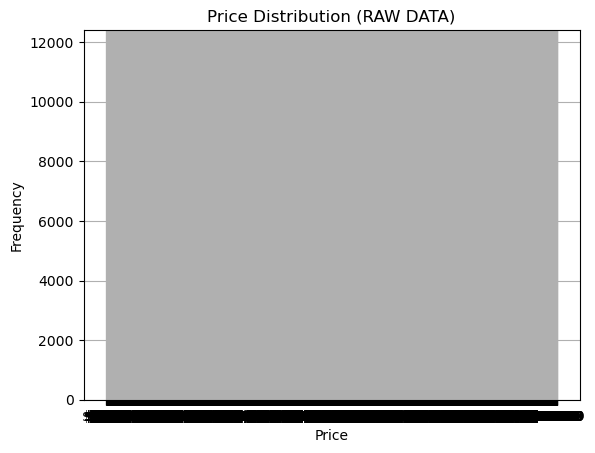
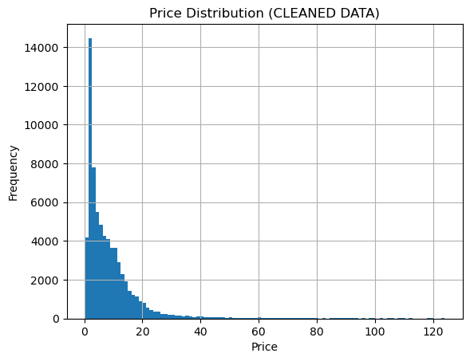
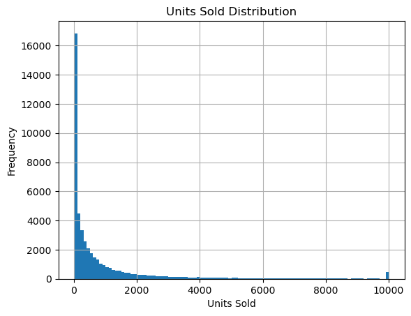
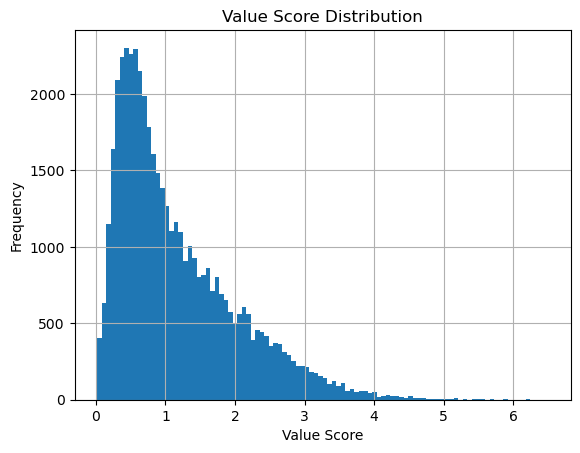

# 🛍️ SHEIN Product Data Cleaning & Value Analysis

## 📌 Project Overview
This project focuses on cleaning and analyzing a large-scale e-commerce dataset from SHEIN (~82k products). The goal is to transform raw scraped data into a structured dataset suitable for business insights and product value analysis.

---

## 📊 Dataset
- Original size: 82,105 rows × 13 columns
- Final size: ~70,292 rows × 19 columns
- Source: Multi-category SHEIN product dataset

---

## 🧹 Data Cleaning Steps
- Removed duplicate product entries
- Standardized price and discount fields
- Parsed textual sales indicators into numeric format
- Handled missing values in key columns

---

## ⚙️ Feature Engineering
Created key analytical features:

- **units_sold**: extracted from text like "10k+ sold recently"
- **units_sold_log**: log-transformed sales for skew normalization
- **price_category**: grouped pricing segments
- **has_discount**: binary discount indicator
- **value_score**: custom metric measuring sales efficiency per price

Formula:
value_score = log(units_sold) / (price + 1)

---

## 📉 Outlier Handling
- Extreme price values were capped using the 99th percentile
- Ensured realistic distribution for retail analysis
- Validated using statistical summaries and visual inspection

---

## 📈 Key Insights
- Strong right-skew in pricing before cleaning
- High correlation between units sold and value score (~0.71)
- Low-priced products dominate high value_score rankings

---

## 🧪 Tools Used
- Python
- Pandas
- Matplotlib
- Jupyter Notebook

---

## 📊 Visualizations

### Price Distribution (Before Cleaning)

### Price Distribution (After Cleaning)

### Units Sold Distribution

### Value Score Distribution

---

## 📁 Final Output
Clean dataset ready for:
- Business analytics
- Product ranking systems
- Pricing strategy modeling

